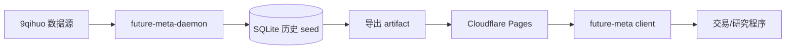

# future-meta

[](https://github.com/zynthium/future-meta/actions/workflows/update-fee-data.yml)
[](https://www.rust-lang.org/)
[](https://future-meta.pages.dev/manifest.json)

中国期货手续费历史数据维护与本地 as-of 查询库。

`future-meta` 将 9qihuo 的手续费数据维护为可版本化的 SQLite 历史库，并导出为压缩二进制 artifact。客户端只需要下载 Cloudflare Pages 上的 `manifest.json` 和 `latest.fmeta.zst`，即可在本地完成高性能手续费查询。

> [!IMPORTANT]
> 本项目不把 9qihuo 当作实时 API 直接转发。daemon 会定期抓取最新截面并自行维护历史；client 查询的是已发布 artifact 中的本地索引。

## 功能特性

- 使用 TqSdk 风格 `symbol` 作为合约唯一标识，例如 `SHFE.cu2607`、`CZCE.SR903`、`KQ.m@SHFE.cu`。
- 支持具体合约、品种下全部合约、主连别名的 as-of 手续费查询。
- 客户端 archive 使用 `bincode` + `zstd` 压缩，并带 SHA-256 校验。
- daemon 使用 SQLite 保存历史版本，按手续费规则变化生成有效期区间。
- GitHub Actions 每天北京时间 18:45 增量更新，Cloudflare Pages 免费层分发静态文件。

## 架构



工作区包含两个 crate：

| Crate | 作用 |
| --- | --- |
| `future-meta` | 公开模型、archive 编解码、下载缓存、TqSdk symbol 解析和 as-of 查询 API |
| `future-meta-daemon` | 9qihuo 抓取、CSV/HTML 解析、SQLite 历史维护、Cloudflare artifact 导出 |

## 快速开始

运行在线 smoke test，从 Cloudflare 下载已发布 artifact 并查询 `SHFE.cu2607`：

```bash
cargo run -p future-meta --features download --example online_smoke SHFE.cu2607 2026-06-08T10:48:06Z
```

在自己的 Rust 程序中使用：

```toml
[dependencies]
future-meta = { git = "https://github.com/zynthium/future-meta", features = ["download"] }
tokio = { version = "1", features = ["macros", "rt-multi-thread"] }
```

```rust
use future_meta::{DownloadConfig, load_or_fetch};

#[tokio::main]
async fn main() -> Result<(), Box<dyn std::error::Error>> {
    let meta = load_or_fetch(DownloadConfig::default()).await?;

    let fee = meta.contract_fee_asof("SHFE.cu2607", "2026-06-08T10:48:06Z")?;
    println!("open={:?}, close_today={:?}", fee.open_fee, fee.close_today_fee);

    let main = meta.main_contract_fee_asof("KQ.m@SHFE.cu", "2026-06-08T10:48:06Z")?;
    println!("main contract fee rule: {}", main.rule_hash);

    Ok(())
}
```

默认 manifest 地址是：

```text
https://future-meta.pages.dev/manifest.json
```

可用 `FUTURE_META_CACHE_DIR` 覆盖客户端 artifact 缓存目录。

## 查询 API

`FutureMeta` 当前提供三类核心查询：

| API | 说明 |
| --- | --- |
| `contract_fee_asof(symbol, at)` | 查询具体期货合约在某个 RFC3339 时间点的手续费 |
| `underlying_fees_asof(underlying_symbol, at)` | 查询某个品种在该时间点可交易合约的手续费列表 |
| `main_contract_fee_asof("KQ.m@...", at)` | 查询主连别名对应的主力合约手续费 |

手续费字段保留源站规则语义：

- `open_fee`
- `close_yesterday_fee`
- `close_today_fee`
- `buy_margin_rate`
- `sell_margin_rate`
- `source_updated_at`
- `valid_from` / `valid_to`

> [!NOTE]
> `valid_from` 为闭区间起点，`valid_to` 为开区间终点。`valid_to = None` 表示当前仍有效。

## 数据来源与边界

历史 seed 与增量更新是两条不同路径：

- 全量历史 seed：本地运行 daemon，按品种下载 `https://www.9qihuo.com/shouxufeixz?heyue=<code>`。
- 每日增量更新：GitHub Actions 拉取 Cloudflare 上的 SQLite seed，解析 `https://www.9qihuo.com/qihuoshouxufei` 的 `table#heyuetbl`，更新最新截面后重新发布 artifact。

项目只持久化手续费查询需要的基础字段。不会把源站展示用派生字段写入 client archive，例如价格、涨跌停、每手保证金、每跳盈亏、手续费折算金额等。

## 本地维护数据

检查已有 seed：

```bash
cargo run -p future-meta-daemon -- inspect --db data/future-meta.sqlite
```

本地全量构建历史 seed：

```bash
cargo run -p future-meta-daemon -- seed-history --db data/future-meta.sqlite --force-full
```

在已有 seed 上应用最新截面：

```bash
cargo run -p future-meta-daemon -- update-latest --db data/future-meta.sqlite --require-seed
```

导出 Cloudflare Pages artifacts：

```bash
cargo run -p future-meta-daemon -- export --db data/future-meta.sqlite --out public
mkdir -p public/ops
gzip -c data/future-meta.sqlite > public/ops/future-meta.sqlite.gz
```

> [!WARNING]
> 初始全量历史抓取请求较多，建议在本地稳定网络或代理环境中手动执行。GitHub Actions 只负责增量更新，不从零构建历史库。

## 部署

当前发布目标是 Cloudflare Pages：

- Production URL: `https://future-meta.pages.dev`
- Manifest: `https://future-meta.pages.dev/manifest.json`
- Daemon seed: `https://future-meta.pages.dev/ops/future-meta.sqlite.gz`

手动部署：

```bash
wrangler pages deploy public --project-name=future-meta --branch=main --commit-dirty=true
```

GitHub Actions workflow 位于 `.github/workflows/update-fee-data.yml`。需要配置以下 secrets：

- `CLOUDFLARE_API_TOKEN`
- `CLOUDFLARE_ACCOUNT_ID`

更多部署细节见 [docs/deployment.md](docs/deployment.md)。

## 开发

常用检查：

```bash
cargo fmt --all -- --check
cargo check --workspace --all-targets
cargo test --workspace
cargo test -p future-meta --features download
```

定向测试：

```bash
cargo test -p future-meta-daemon --test daemon_pipeline
cargo test -p future-meta --features download --test client_archive
```

生成目录默认不提交：

- `data/`
- `public/`
- `target/`
- `.env`
- `.mcp.json`

## 常见问题

**为什么不让 client 直接请求 9qihuo？**

源站可能限频、返回 503 或出现反爬 HTML。client 直接依赖源站会不稳定，也无法查询任意历史时间点。当前设计由 daemon 维护历史，client 只查询已校验 artifact。

**为什么 latest 更新解析 HTML，而不是下载全合约 CSV？**

总页的 Excel 按钮是浏览器端 `tableToExcel('heyuetbl', ...)` 从 HTML 表格生成，目前没有稳定的全合约 CSV 下载端点。单品种历史仍使用 `shouxufeixz?heyue=<code>` CSV。

**如果新增合约没有静态元数据怎么办？**

latest HTML 不一定提供上市日、到期日、每手数量、最小跳动等静态元数据。daemon 只会从已有 seed 补齐；seed 不认识的新合约会等下一次本地全量 seed。
